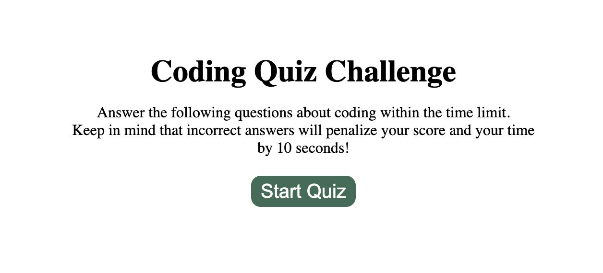
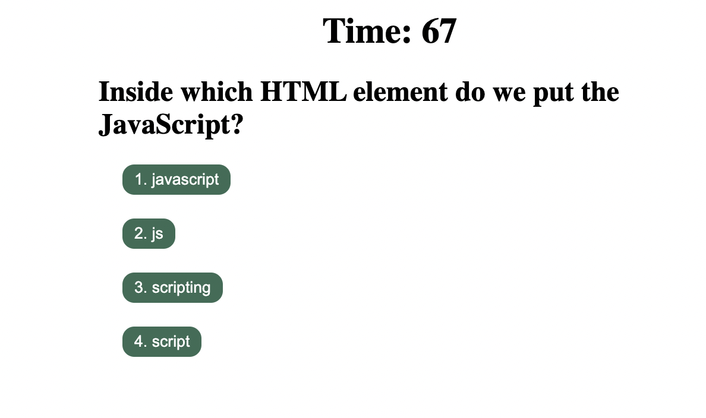
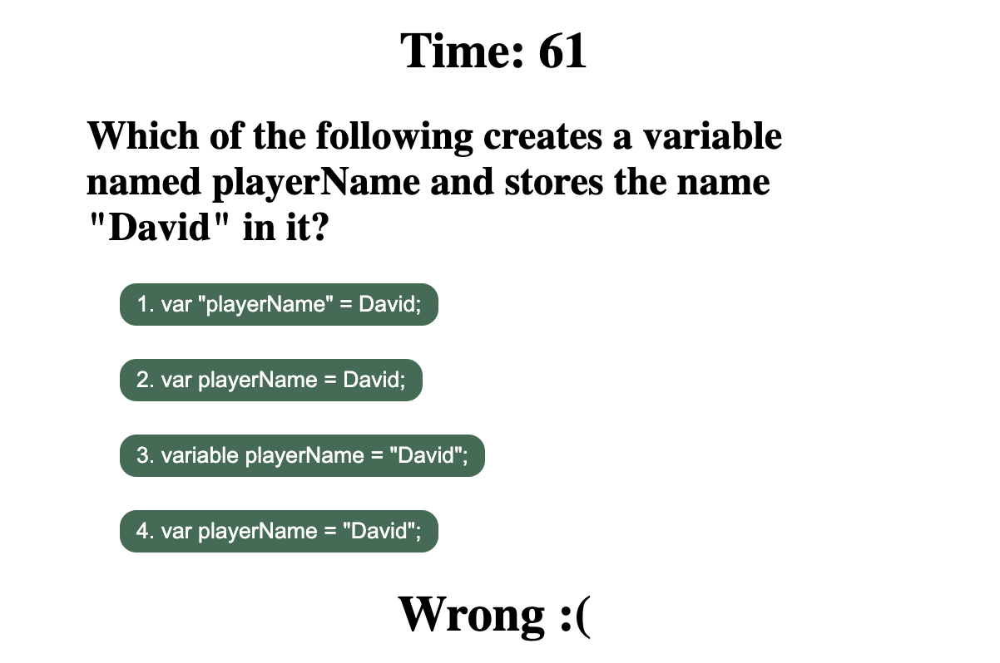
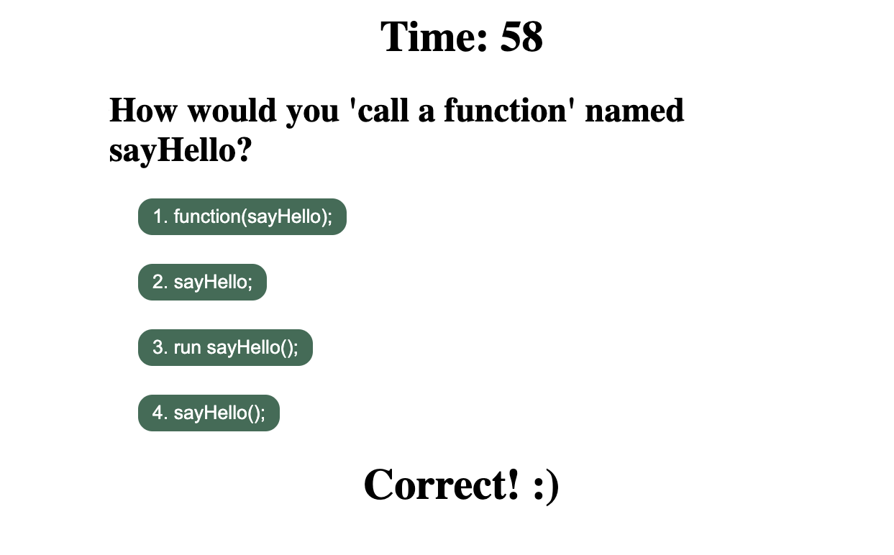
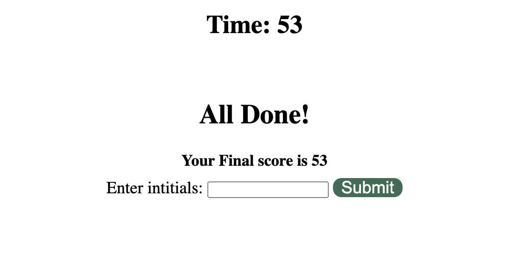
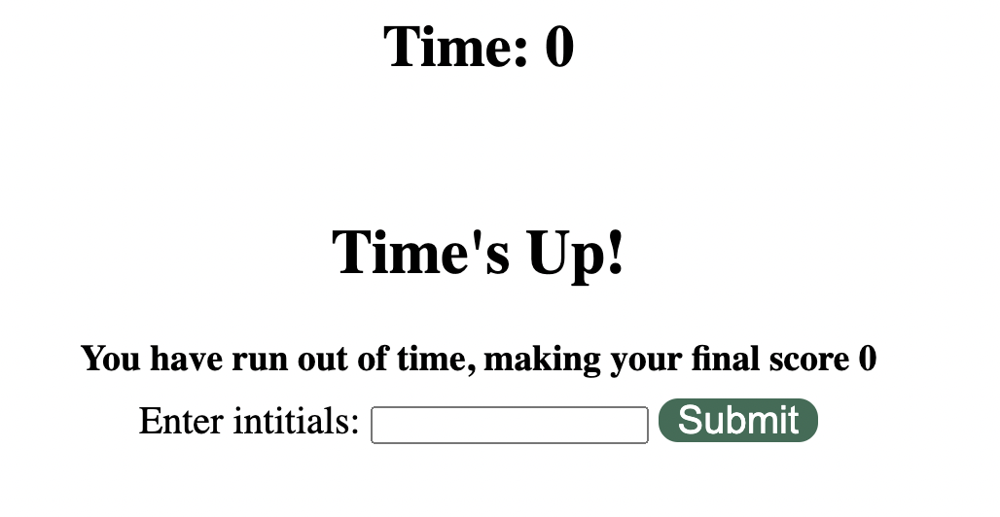
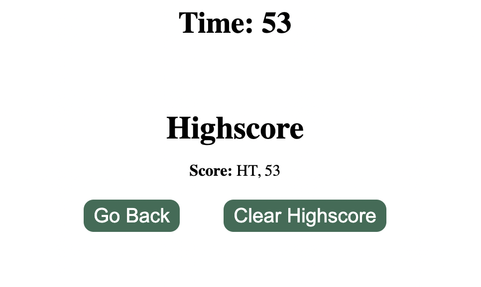

# Challenge4-CodeQuiz

## Description

An interactive, timed quiz on javacript fundamentals. The time left once the quiz is finished will be the user's score. This quiz feeatures multiple choice questions where if the wrong question is clicked then 10 points are subtracted from your score/time. If a user runs out of time, then they are imediately taken to a time's up page where their score is 0 and they can enter their initials to save both their score and initials. If the user finishes the quiz within the given time, then they are taken to a page that shows them their score and allows them to enter their initials to save both their score and initials. When the user enters their intitials to save their score, then they are taken to a page that shows their last saved score with a button to clear score and a button to go back to start of quiz.

### Links

Deployed Site URL: [https://haleymay21.github.io/Challenge4-CodeQuiz/]

#### Screenshot

